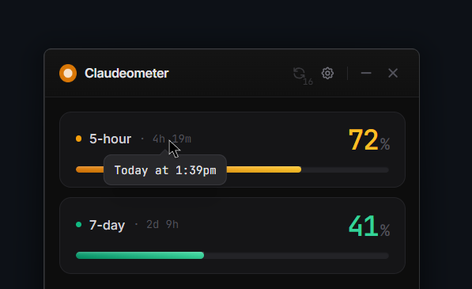
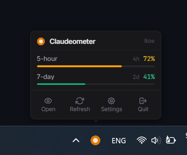
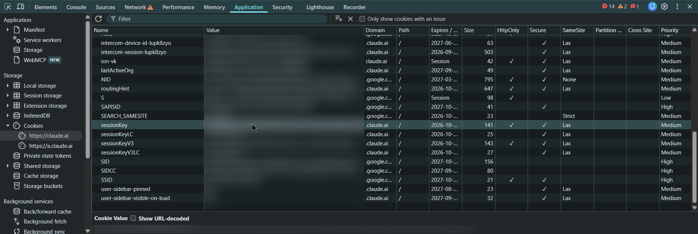
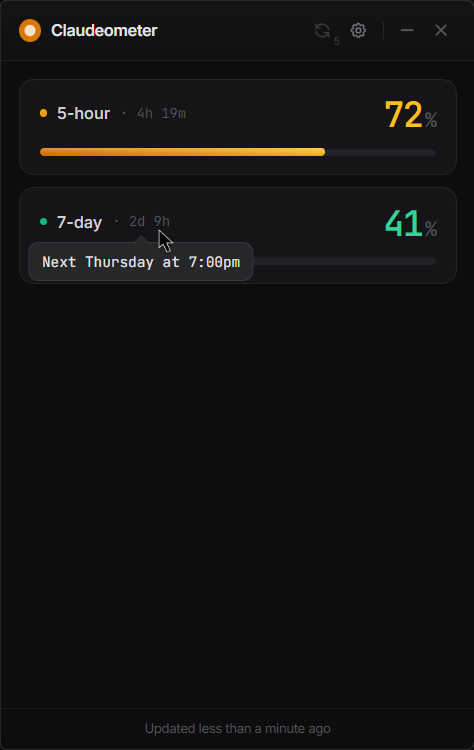
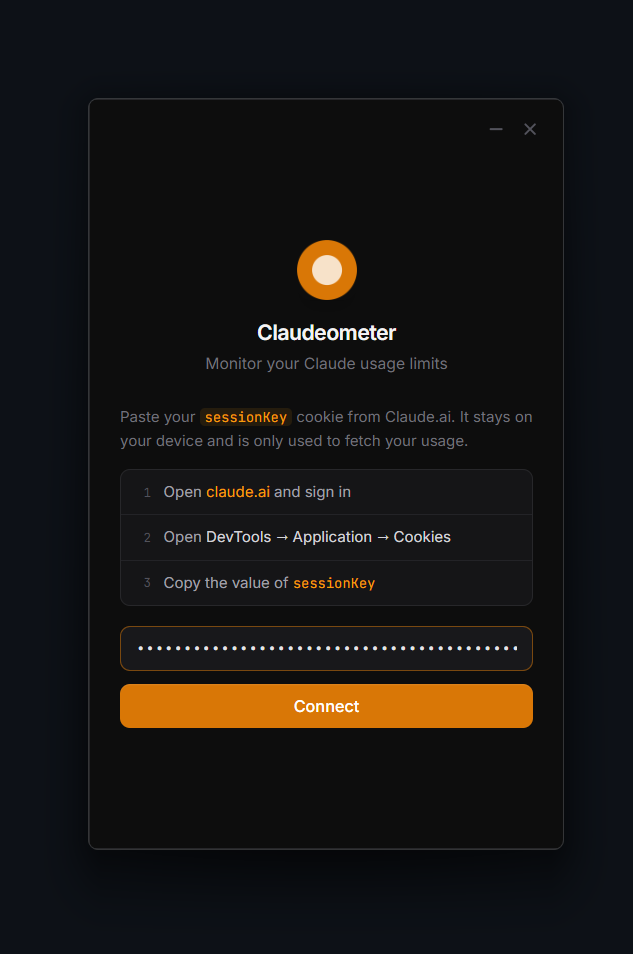
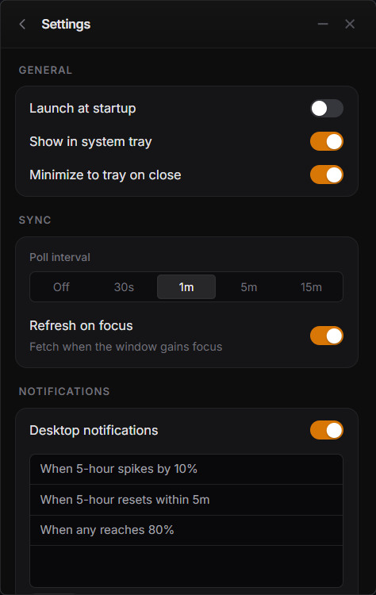
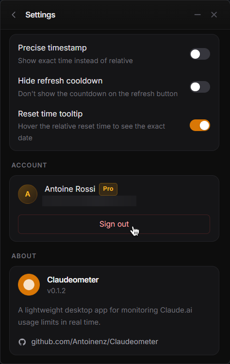
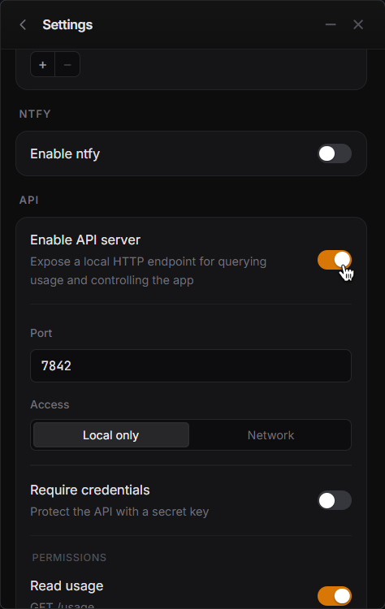
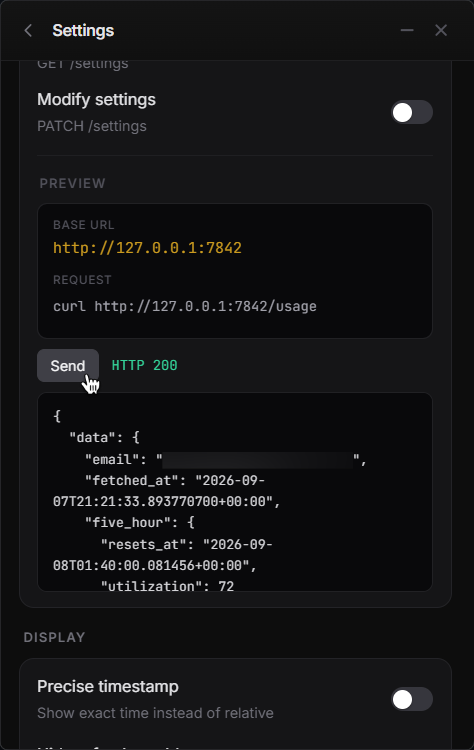

<div align="center">


# Claudeometer

**A lightweight desktop app for monitoring Claude.ai usage limits in real time. Built with Tauri v2, Rust, and React.**

See your 5-hour and 7-day usage live from the system tray, and get notified as you approach a limit or when one resets. More importantly, the built-in HTTP API and [headless service](#headless-service-no-gui) mode expose that same data on `localhost` — so a coding agent can check its own usage and stop cleanly before it gets cut off, instead of hitting the limit blind.

<br>

 &nbsp; 

</div>

## Features

- **Live usage bars** — live usage bars for your 5-hour, 7-day, and 7-day Sonnet limits
- **Reset time tooltip** — hover the relative reset time to see the exact date and time
- **System tray** — compact tray menu with usage summary, one-click refresh, and last-updated timestamp, always synced with the main window
- **Background polling** — automatic background polling with a configurable interval
- **Desktop notifications** — rule-based alerts for usage thresholds, spikes, resets, and recoveries
- **[ntfy](https://ntfy.sh) support** — push notifications to any ntfy server using the same rule system
- **HTTP API server** — optional local (or network-accessible) REST API for reading usage data, triggering refreshes, and querying settings from scripts and external tools
- **Minimize to tray** — close button hides the window; the app keeps running in the background
- **Launch at startup** — register as a login item on all platforms
- **Credential security** — session key stored in the OS keychain (Windows Credential Manager, macOS Keychain, libsecret on Linux), never written to disk in plain text
- **Minimal footprint** - built with Tauri instead of Electron


## Installation

Download the latest release for your platform from the [Release](https://github.com/Antoinenz/Claudeometer/releases/latest) page:

| Platform | File |
|----------|------|
| Windows  | `.msi` or `.exe` installer |
| macOS    | `.dmg` |
| Linux    | `.deb` or `.AppImage` |

## Setup

1. Open [**Claude.ai**](https://claude.ai) in your browser and sign in
2. Right-click anywhere to open the context menu, then inspect to open DevTools
3. Application → Cookies → `https://claude.ai` → find `sessionKey`
4. Copy the value and paste it into Claudeometer when prompted



Don't share this key with anyone. The session key is saved securely to your OS keychain and never stored anywhere else.

Signing out of a session will make that key invalid.

## Headless service (no GUI)

Want to leave usage monitoring running on a server — so a coding agent can
`curl` its usage before doing more work and stop cleanly instead of getting
cut off — without the desktop app? `claudeometer-service` is a small
standalone binary for exactly that:

```bash
curl -fsSL https://raw.githubusercontent.com/Antoinenz/Claudeometer/main/scripts/install.sh | sh
claudeometer-service login <your-session-key>
claudeometer-service install
```

Three commands, and it's running in the background (systemd on Linux, a
LaunchAgent on macOS, a Windows service on Windows) serving `GET /usage` on
`http://127.0.0.1:7842`. `claudeometer-service status` gives a quick terminal
glance any time. See [docs/SERVICE.md](docs/SERVICE.md) for the full CLI and
API reference.

## Development

**Prerequisites:** Rust (stable), Node.js (LTS), platform WebView runtime (WebView2 on Windows, pre-installed on macOS/Linux)

```bash
# Install dependencies
npm install

# Run in dev mode (hot-reloads both Vite and Tauri)
npm run tauri dev

# Build a production bundle
npm run tauri build
```

See [docs/DEVELOPER.md](docs/DEVELOPER.md) for architecture details, the full Tauri event system, and the complete API server reference.

## Notifications

Rules are edge-triggered — each rule fires once per crossing rather than on every poll:

| Type | Fires when |
|------|-----------|
| Threshold | Usage rises above a set percentage |
| Spike | Usage jumps by more than a set amount between polls |
| Reset soon | A window is within a set time of resetting |
| Recovery | Usage falls back below a set percentage |

Both desktop notifications and [ntfy](https://ntfy.sh) push notifications are supported, each with their own independent rule sets.

## Screenshots

<details>
<summary>More screenshots</summary>
<br>

 &nbsp; 

 &nbsp; 

 &nbsp; 

(Screenshots taken of version 0.1.2 on Windows)
</details>

## License

[MIT](https://github.com/Antoinenz/Claudeometer?tab=MIT-1-ov-file)
